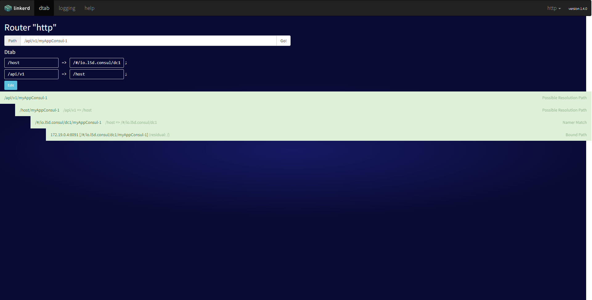

#### How to run:
```docker-compose up -d```

##### Test via `curl`:
`curl http://localhost:4140/api/v1/myAppConsul-1 -I`

You should obtain:
```
λ curl http://localhost:4140/api/v1/myAppConsul-1 -I
HTTP/1.1 502 Bad Gateway
l5d-err: No+hosts+are+available+for+%2Fapi%2Fv1%2Fapi%2C+Dtab.base%3D%5B%2Fhost%3D%3E%2F%23%2Fio.l5d.consul%2Fdc1%3B%2Fapi%2Fv1%3D%3E%2Fhost%5D%2C+Dtab.local%3D%5B%5D.+Remote+Info%3A+Not+Available
Content-Length: 137
Content-Type: text/plain
```

Although check via linkerd admin delegator panel show it should be available:

